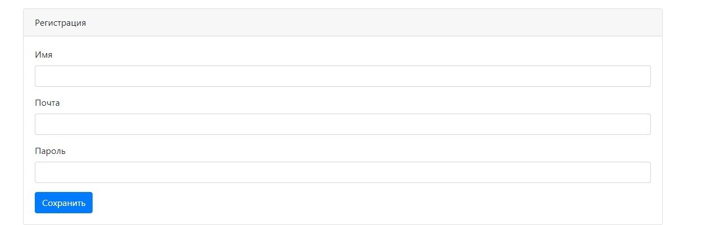
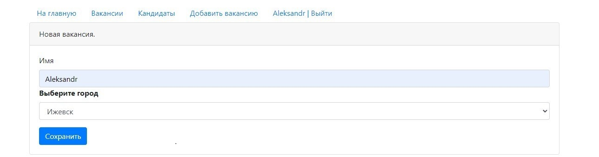
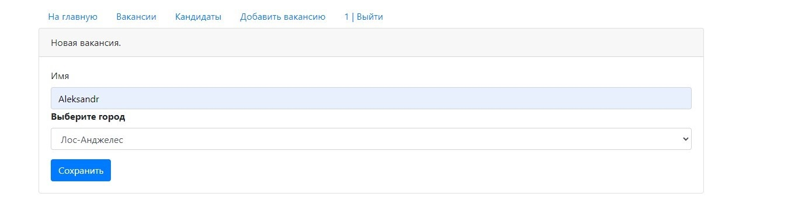

# job4j_dreamjob

Программа предназначен для регистрации вакансий и предложений о рабате.

Первая страница требует ввести свои данные или регистрации если вы еще не зарегистрированные в системе!

Если нажать на поле зарегистрироваться, то попадаем на страницу регистрации.

После того как мы зарегистрировались и авторизация прошла успешно, мы попадаем на главную страницу, где
размещены объявления за последние сутки как кандидатов так и работодателей!

На странице "Кандидаты" мы можем посмотреть всех кандидатов за все время отдельно, отредактировать кандидата (загрузить
фото, удалить кандидата).

На странице "Вакансии" мы можем посмотреть все вакансии за все время и так же отредактировать вакансии.

Перейдя на страницу "Добавить вакансию" мы создаем и добавляем новую вакансию в список.

Перейдя на страницу "Добавить кандидата" мы можем создать нового соискателя.

